CS625-HW5
================
Anuradha Mantena
10/26/2020

### Creating Distribution charts using Vegalite:

For each of the distributions, I have created 2 histograms, 1 eCDF, and
1 boxplot as asked in veg-lite.

Here is my vega-lite notebook link:
<https://observablehq.com/d/767d2d1bf04cf7b8>

##### Dataset 1:

###### Data Source:

I have downloaded the data from the reference (see reference 1). This
data set has around 3143 observations with six columns named \[Never,
Rarely, Sometimes, Frequently, Always\].

##### Box-Plot:

To display box-plot all the columns (Never, Rarely, Sometimes,
Frequently, Always) If we upload the CSV file that we have downloaded
from the link it won’t allow us to display all the six columns on the
axis. For this, we need to do data modification. I have opened another
tab in the excel sheet and added two columns with the names “Results”
and “values”. I have changed all the rows in the “Results” field to
“Never” and for the values. I used vlookup to get all the values from
my original tab. Below is the snapshot for reference. Do vlookup for all
the columns separately in each excel tab. Once you are done, copy-paste
each tab sheet values in the first tab sheet that you have created.

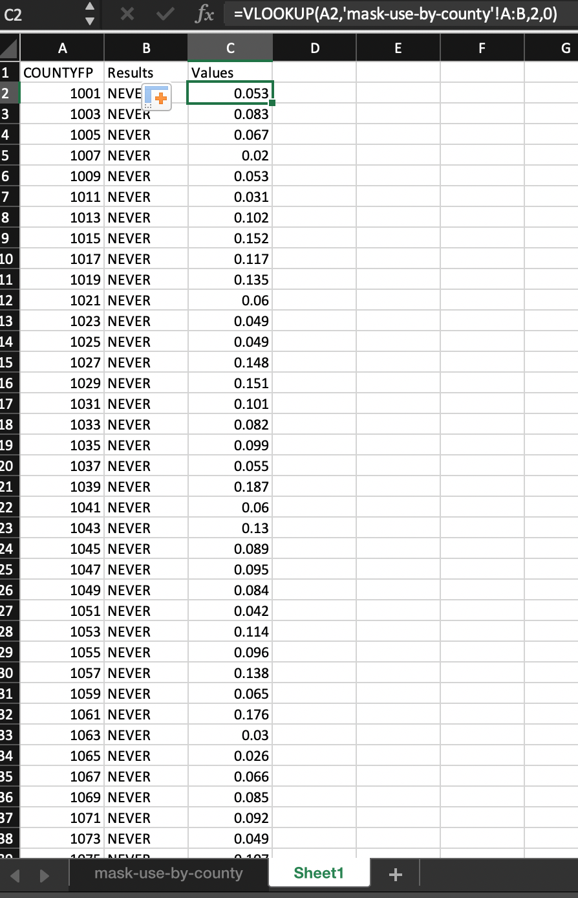

I have copied all the data and pasted in a separate excel as my original
excel sheets contain several tabs. I have uploaded my new sheet in the
vega-lite notebook. Use vl.markBoxplot to create Boxplot. Consider all
the column results on the x-axis and values on the y-axis. Use vl.color
to show the results in different colors. Below is the result:


Observations:

The boxplot shows the percentiles/quartiles for distribution of data
based on minimum, first quartile, median, third quartile, and maximum,
unlike the count. From the above chart, it is observed that the median
value is high for Always. We could see more outliers for the results -
Frequently.

##### Histogram-1 :

As given in the question, I have combined both frequently and Always
columns from the original data sheet and pasted in a separate excel
sheet. I have uploaded the same file in the vega-lite workbook.

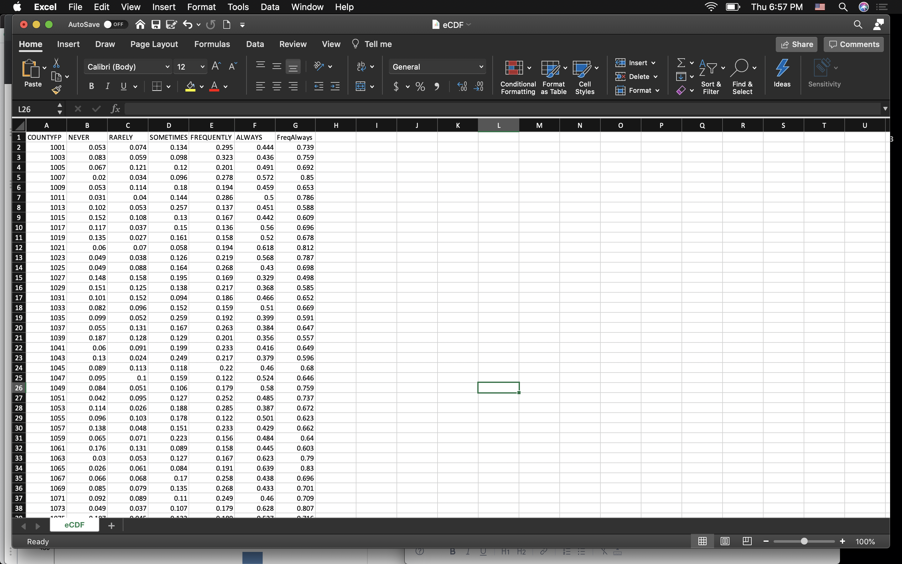

I have used vl.markBar() to plot the histogram. I have considered the
(FreqAlways) column on the x-axis and on the y-axis, I have taken the
aggregate of count to show the count. I referred to a document on how to
display bin sizes( see reference 2). Here I have considered max bins to
10. But I could see there are 7 bins within the values of 1. Below is
the result:


##### Histogram-2 :

Increasing, and reducing the bin width sometimes helps us look deep into
the distribution patterns. For the second chart, I have changed the bin
size to 30. I could see the results got split in each bin and 15 bins
were created.

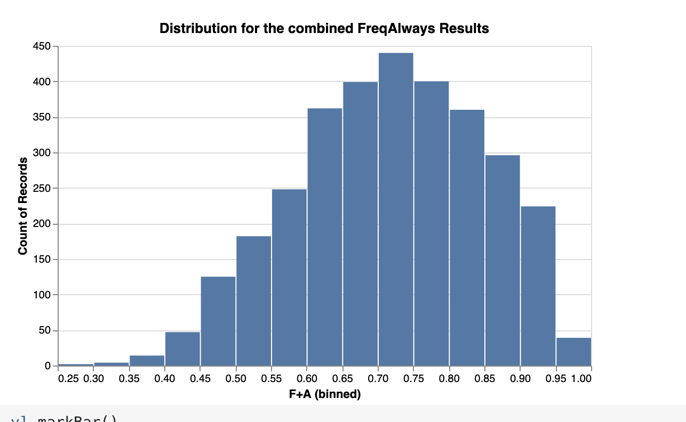

Observations:

Histograms give us the idea of a frequency distribution. We could
compare the bins with the count. From the above figures, it is observed
that a count of 830 results was found for the values of 0.70 which means
that 70% of people are using masks i.e frequency and always. In the
second histogram, we could see that there is no change in bin size.

##### eCDF:

As given in the question, I have combined both frequently and Always
columns from the original data sheet and pasted in a separate excel
sheet. I have used the same data file which I used to plot histograms.

I have referred to a document to plot the eCDF in the vega-lite(see
reference 3). I have used the window transform to accumulate count in a
cumulative frequency distribution plot. I have considered the line for
eCDF to show the distribution clearly.

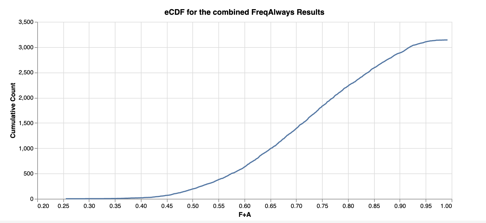

Observations:

Empirical cumulative distributive function normalizes the count on the
y-axis, so, here we will be able to read what proportion/percentage of
results were made for the column Frequently and Always(F+A). In the
chart I have created, the proportions are shown for each value in the
form of a step. We can trace the x and y-axis values at each step in the
chart.

###### Best Idiom :

For this dataset, I feel like the histogram is the best-suited idiom as
in the histogram we could see the proper distribution result of the
values for the fields based on the count. Even a nontechnical person can
clearly understand what the histogram shows. A complicated idiom would
be the boxplot as it is difficult to identify the median, quartile, and
percentiles/proportions to find the result values.

##### Dataset 2:

###### Data Source:

I have downloaded the data from the reference (see reference 4). This
data set has around 3194 observations with 164 columns. This dataset
shows the distribution of the population of all counties in the US as of
the 2010 Census.

##### Box-Plot:

I have uploaded the same data file that I have downloaded from the link.
Here I have considered the ‘CENSUS2010POP’ column as the x-axis. From
the plot, we could see only a single boxplot glyph. It is observed that
there are few outliers up to 40 lakhs. The maximum population of all
counties in the US is between 0-10 lakhs.


##### Histogram-1 :

I have considered ‘CENSUS2010POP’ on the x-axis and aggregate count on
the y-axis. From the below figure, it is observed that around 3200
counties are having a population between 0 - 40 lakhs. Here I used bin
as true so we could clearly see the max population is between 0-5 lakhs
and only around 1% of counties are having a population between
5-10lakhs. I have even checked with a bin with size 10 (I commented on
this line in my code) but I couldn’t figure out any difference in bins.

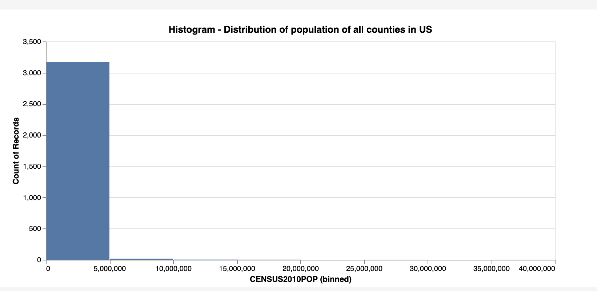

##### Histogram-2 :

I wanted to see the exact interval that the highest number of movies
were made and reduced the bin width. This helped me discover that the
highest number of movies were made between the period 1993 and 1997
precisely. In this plot, I have given the Max bins of 30 but I could see
as the split of two bins with 0-4,000,000 and other 4,000,000 to
6,000,000.


##### eCDF:

In this plot, I have used the window transform function to display the
cumulative count. I have considered Cumulative Count on Y-axis and
CENSUS2010POP on the x-axis. From the plot, it is observed that the
curve is increasing from 0 and maintaining a constant level of up to 40
lakhs.

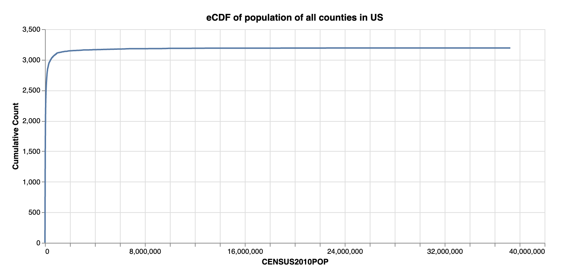

###### Best Idiom :

For this dataset, I feel like the all three are showing proper results
but box plot is giving more accurate results it is showing the outliers
for the population with respect to all the counties.

##### Dataset 3:

###### Data Source:

I have downloaded the data from the reference (see reference 4). This
data set has around 58 observations with 150 columns. This dataset shows
the distribution of the population of all counties in the US as of the
2010 Census.

##### Box-Plot:

I have modified the data as to how I did it for dataset1. I took vlookup
for the columns (RBIRTH2019, RDEATH2019, and RNETMIG2019) columns. I
have pasted these values in the separate excel and I have uploaded the
same in my vega-lite workbook.

For this boxplot, I have considered the Distributions on X-axis
(RBIRTH2019, RDEATH2019, and RNETMIG2019) and respective values on the
y-axis.

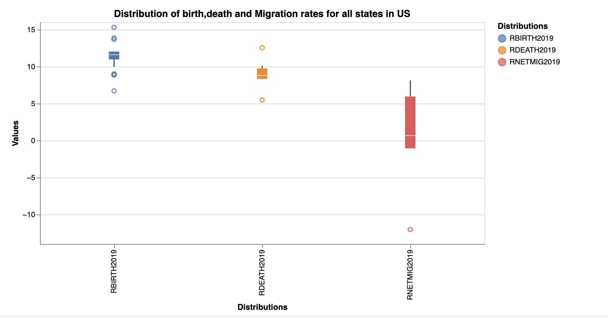

From the above figure, it is observed that there are outliers in the
field RNETIMIG2019 and the distribution of Migration is more. The
birthrate is higher at the same it also has more outliers.

##### Histogram-1 :

For this question, we can consider anyone column of birth rates, death
rates, or migration rates. I have uploaded the dataset that I downloaded
from reference 4. I have done the distribution of death rate for the
year 2019 for all the states in the US.

I have used markBar() to plot the histogram. I have considered the
RDEATH2019 column on the x-axis and aggregate count on the y-axis.

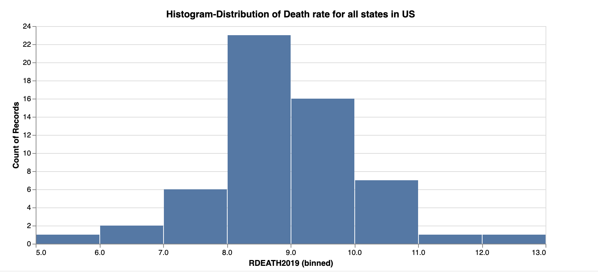

From the above figure, it is observed that the death rate is high
between 8.0 to 9.0 for about 23 states. Here I have given bin size as 10
and the plot is distributed for all 10 bins.

##### Histogram-2:

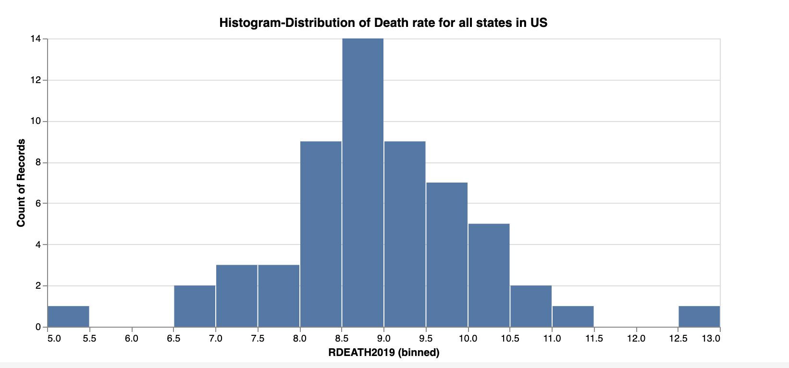

I actually wanted to check the exact interval where the highest number
of count is registered. I have increased the size to 30 and I could see
the 16 bins in the plot with proper count values.

##### eCDF:

To plot eCDF, I have used markLine(). I used the window transform
function to display the cumulative count. I have considered Cumulative
Count on the y-axis and RDEATH2019 on the x-axis.


From the figure, it is noticed that there is a gradual increase in the
death rate and has reached up to 12%.

###### Best Idiom :

For all the datasets, I feel like the histogram and eCDF both are best.
From histogram it is observed that the count of distribution and from
the ecdf plot we can figured it out the gradual increase of the
distirbution curve for the deathrate. I think box plot is little
complicated to identify the results at a glance.

### Creating Distribution charts using R:

I have tried creating all the 12 charts in R as well using the ggplot2
library. I have referred all the documents that you shared with us using
the ggplot2 function. (keeping the same references that you shared with
us see references 5,6, and 7)

First, I have imported all the library packages in r and I did install
on my R application by clicking on Tools-\>Install Packages -\> Enter
the package and click on Install (see reference 8).

Below is my code that I have used to create the distribution charts for
all the three datasets is:

``` r
library(ggplot2)
library(dplyr)
```

    ## 
    ## Attaching package: 'dplyr'

    ## The following objects are masked from 'package:stats':
    ## 
    ##     filter, lag

    ## The following objects are masked from 'package:base':
    ## 
    ##     intersect, setdiff, setequal, union

``` r
library(tidyverse)
```

    ## ── Attaching packages ─────────────────────────────────────── tidyverse 1.3.0 ──

    ## ✓ tibble  3.0.4     ✓ purrr   0.3.4
    ## ✓ tidyr   1.1.2     ✓ stringr 1.4.0
    ## ✓ readr   1.4.0     ✓ forcats 0.5.0

    ## ── Conflicts ────────────────────────────────────────── tidyverse_conflicts() ──
    ## x dplyr::filter() masks stats::filter()
    ## x dplyr::lag()    masks stats::lag()

``` r
abc <- read.csv(file="data/Q1data.csv")

ggplot(abc, aes(y=Values, x=Results)) +
    geom_boxplot(fill = "white", colour = "#3366FF")+
  ggtitle(label = "Distribution of Results for Boxplot")
```

<!-- -->

``` r
ecdf <- read.csv(file="data/eCDF.csv")

ggplot(ecdf, aes(x=FreqAlways)) +
   geom_histogram(binwidth =0.1)+
  ggtitle(label = "Distribution for the combined FreqAlways Results")
```

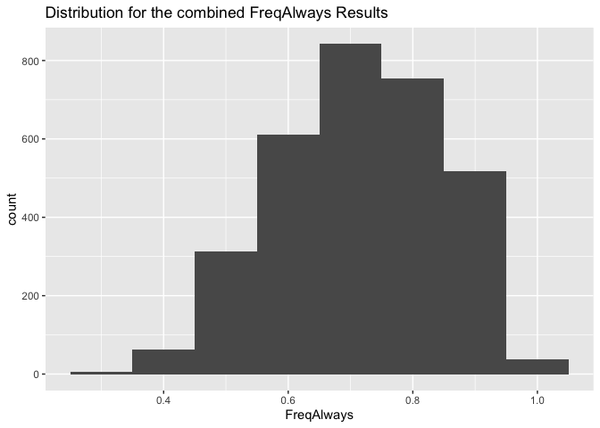<!-- -->

``` r
ggplot(ecdf, aes(x=FreqAlways)) +
   geom_bar() +
  scale_x_binned()+
  ggtitle(label = "Distribution for the combined FreqAlways Results")
```

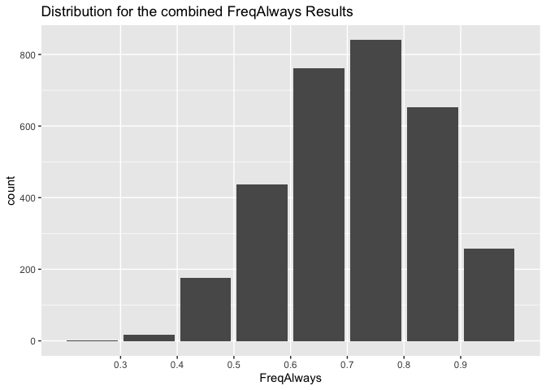<!-- -->

``` r
ggplot(ecdf, aes(FreqAlways)) + stat_ecdf(geom = "step", na.rm = TRUE, col = "deepskyblue2")+
  ggtitle(label = "eCDF Distribution for the combined FreqAlways Results")
```

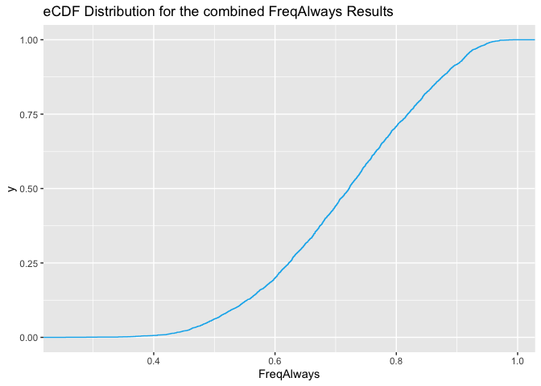<!-- -->

``` r
q2 <- read.csv(file="data/co-est2019-alldata.csv")

ggplot(q2, aes(x=CENSUS2010POP)) +
    geom_boxplot(fill = "white", colour = "#3366FF")+
  ggtitle(label = "Distribution of population of all counties in US")
```

<!-- -->

``` r
ggplot(q2, aes(x=CENSUS2010POP)) +
    geom_bar()+
  scale_x_binned()+
  ggtitle(label = "Histogram-Distribution for the combined FreqAlways Results")
```

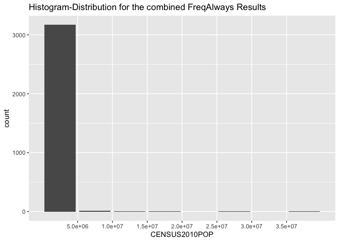<!-- -->

``` r
ggplot(q2, aes(x=CENSUS2010POP)) +
   geom_histogram(binwidth=40, col = "deepskyblue2")+
  ggtitle(label = "Histogram- Distribution for the combined FreqAlways Results")
```

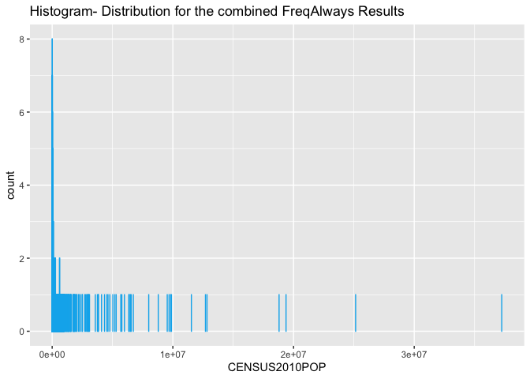<!-- -->

``` r
ggplot(q2, aes(x=CENSUS2010POP)) + stat_ecdf(geom = "step", na.rm = TRUE, col = "deepskyblue2")+
  ggtitle(label = "eCDF-Distribution of population of all counties in US")
```

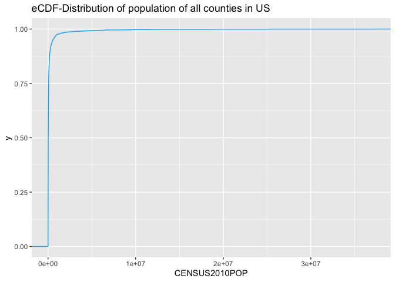<!-- -->

``` r
nst <- read.csv(file="data/nst-est2019-alldata.csv")

ggplot(nst, aes(x=RDEATH2019)) +
   geom_histogram(binwidth=0.1, col = "deepskyblue2")+
ggtitle(label = "Histogram-Distribution of Death rate for all states in US")
```

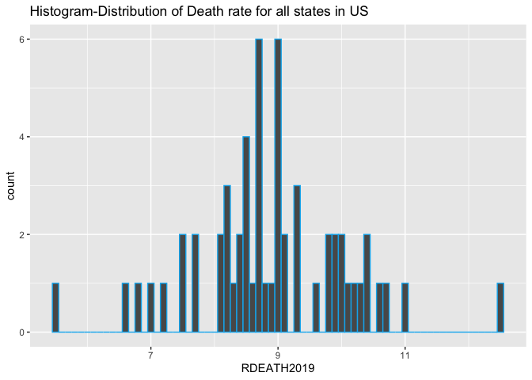<!-- -->

``` r
ggplot(nst, aes(x=RDEATH2019)) +
    geom_bar()+
  scale_x_binned()+
ggtitle(label = "Histogram-Distribution of Death rate for all states in US")
```

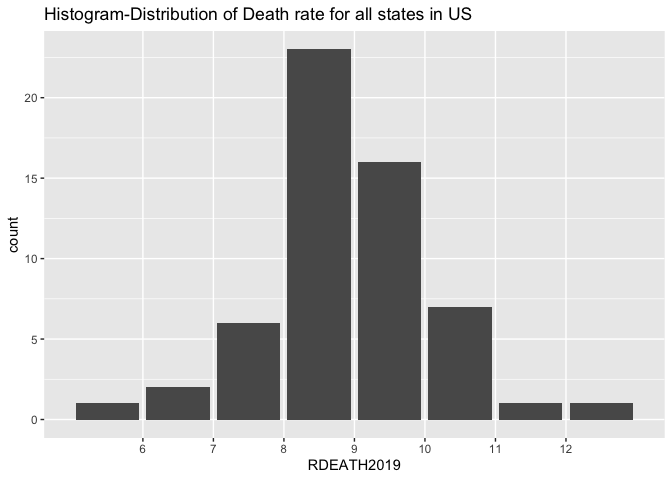<!-- -->

``` r
ggplot(nst, aes(x=RDEATH2019)) + stat_ecdf(geom = "step", na.rm = TRUE, col = "deepskyblue2")+
ggtitle(label = "eCDF Distribution of Death rate for all states in US")
```

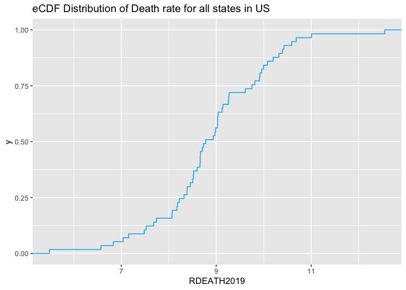<!-- -->

References:

1.  NYT Mask Usage Survey dataset link:
    <https://raw.githubusercontent.com/nytimes/covid-19-data/master/mask-use/mask-use-by-county.csv>

2.  Histogram Bins:
    <https://vega.github.io/vega-lite/docs/bin.html#histogram>

3.  eCDF cumulative count:
    <https://vega.github.io/vega-lite/docs/window.html#cumulative-frequency-distribution>

4.  US Census Bureau County Population dataset:
    <https://www2.census.gov/programs-surveys/popest/datasets/2010-2019/counties/totals/co-est2019-alldata.csv>

5.  Boxplot- R using ggplot2:
    <https://ggplot2.tidyverse.org/reference/geom_boxplot.html>

6.  Histogram- R using ggplot2:
    <https://ggplot2.tidyverse.org/reference/geom_histogram.html>

7.  eCDF- R using ggplot2:
    <https://ggplot2.tidyverse.org/reference/stat_ecdf.html>

8.  Packages Installation on R-studio:
    <https://www.datacamp.com/community/tutorials/r-packages-guide>
