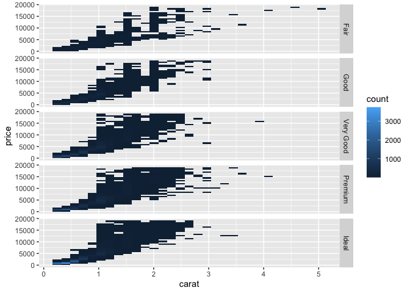

CS625-HW6
================
Anuradha Mantena
11/06/2020

``` r
library(nycflights13)
library(tidyverse)
```

    ## ── Attaching packages ─────────────────────────────────────── tidyverse 1.3.0 ──

    ## ✓ ggplot2 3.3.2     ✓ purrr   0.3.4
    ## ✓ tibble  3.0.4     ✓ dplyr   1.0.2
    ## ✓ tidyr   1.1.2     ✓ stringr 1.4.0
    ## ✓ readr   1.4.0     ✓ forcats 0.5.0

    ## ── Conflicts ────────────────────────────────────────── tidyverse_conflicts() ──
    ## x dplyr::filter() masks stats::filter()
    ## x dplyr::lag()    masks stats::lag()

###### Section 5.6.7

#### Q1. Look at the number of canceled flights per day. Is there a pattern? Is the proportion of canceled flights related to the average delay?

##### Solution:

There are multiple ways to calculate the canceled flights, one is by
checking arrival delay, another is departure delay and the other is by
checking the air time. We will calculate the canceled flights first.
Canceled flights per day are the number of canceled flights increases
with the total number of flights per day.

``` r
library(ggplot2)
library(dplyr)
library(tidyverse)

flights %>%
  group_by(day) %>%
  mutate(cancelled_flights = (is.na(arr_delay) | is.na(dep_delay))) %>%
  group_by(year, month, day) %>%
  summarise(
    cancelled_flights = sum(cancelled_flights),
    flights_num = n(),
  ) %>%

ggplot(aes(y =cancelled_flights, x = flights_num)) +
  geom_point()
```

    ## `summarise()` regrouping output by 'year', 'month' (override with `.groups` argument)

<!-- -->

The above figure shows the number of flights canceled increases with the
total number of flights. The second part of the question asks to
calculate the proportion of canceled flights related to the average
delay. We can do this by finding the average departure delay or arrival
delay.

``` r
flights %>%
  group_by(day) %>%
  mutate(cancelled_flights = (is.na(arr_delay) | is.na(dep_delay))) %>%
  summarise(prop_cancelled = sum(is.na(air_time)) / n(),
          avgerage_dep_delay = mean(dep_delay, na.rm = T)) %>%
 ggplot(aes(y =prop_cancelled, x = avgerage_dep_delay)) +
  geom_point()+
   geom_smooth(method = "lm", se = FALSE)
```

    ## `summarise()` ungrouping output (override with `.groups` argument)

    ## `geom_smooth()` using formula 'y ~ x'

<!-- -->

We can plot the above graph by considering arr\_delay, dep\_delay and
air\_time. From the figure, it is observed that there is a strong
relationship between the number of canceled flights and the average
delay. The proportion of canceled flights increases with the average
delay of flights.

###### Section 5.7.1

#### Q2. Which plane (tailnum) has the worst on-time record?

##### Solution:

To calculate the worst time there are two ways one is by checking the
delay in departure which also leads to arrival delay or another way is
by directly checking the arrival delay. I grouped tailnum and then I
filtered out the arr\_delay column and calculated the mean for average
arrival delay.

The below table shows us the information about flights along with the
average delay.

``` r
arrange(flights, desc(arr_delay)) %>%
  filter(!is.na(arr_delay)) %>%
  group_by(tailnum) %>%
  summarise(mean_arr= mean(arr_delay, na.rm =T)) %>%
  arrange(desc(mean_arr))
```

    ## `summarise()` ungrouping output (override with `.groups` argument)

    ## # A tibble: 4,037 x 2
    ##    tailnum mean_arr
    ##    <chr>      <dbl>
    ##  1 N844MH      320 
    ##  2 N911DA      294 
    ##  3 N922EV      276 
    ##  4 N587NW      264 
    ##  5 N851NW      219 
    ##  6 N928DN      201 
    ##  7 N7715E      188 
    ##  8 N654UA      185 
    ##  9 N665MQ      175.
    ## 10 N427SW      157 
    ## # … with 4,027 more rows

From the above results, we could see that the flight N844MH has more
delaytime and it has worst on-time record followed by N911DA with 294
minutes in delay.

#### Q3. For each destination, compute the total minutes of delay. Don’t need to answer the 2nd part of the question in the book.

##### Solution:

We can answer this question in two ways, either by calculating the
arrival delay or by using departure delay. Here I grouped by destination
and then filtered out all the arr\_delay variables. Calculate the mean
for arr\_delay and use arrange variable to show it in ascending order.

``` r
flights %>% 
        group_by(dest) %>% 
        filter(!is.na(arr_delay)) %>%
  summarise(tot_delay_in_mins = sum(arr_delay[arr_delay > 0])) %>%
 arrange(tot_delay_in_mins)
```

    ## `summarise()` ungrouping output (override with `.groups` argument)

    ## # A tibble: 104 x 2
    ##    dest  tot_delay_in_mins
    ##    <chr>             <dbl>
    ##  1 LEX                   0
    ##  2 PSP                  36
    ##  3 ANC                  62
    ##  4 HDN                 119
    ##  5 SBN                 125
    ##  6 MTJ                 170
    ##  7 EYW                 194
    ##  8 BZN                 491
    ##  9 JAC                 619
    ## 10 CHO                 947
    ## # … with 94 more rows

From the above table, we could see that the LEX destination has 0 mins
of delay followed by PSP destination with 36 mins of delay.

###### Section 7.3.4

#### Q4.Explore the distribution of price. Do you discover anything unusual or surprising? (Hint: Carefully think about the binwidth and make sure you try a wide range of values.)

##### Solution:

Firstly, I wanted to check the columns in the diamonds data, I have
printed all the columns. We could see there are 10 columns and 53,940
rows.

``` r
diamonds
```

    ## # A tibble: 53,940 x 10
    ##    carat cut       color clarity depth table price     x     y     z
    ##    <dbl> <ord>     <ord> <ord>   <dbl> <dbl> <int> <dbl> <dbl> <dbl>
    ##  1 0.23  Ideal     E     SI2      61.5    55   326  3.95  3.98  2.43
    ##  2 0.21  Premium   E     SI1      59.8    61   326  3.89  3.84  2.31
    ##  3 0.23  Good      E     VS1      56.9    65   327  4.05  4.07  2.31
    ##  4 0.290 Premium   I     VS2      62.4    58   334  4.2   4.23  2.63
    ##  5 0.31  Good      J     SI2      63.3    58   335  4.34  4.35  2.75
    ##  6 0.24  Very Good J     VVS2     62.8    57   336  3.94  3.96  2.48
    ##  7 0.24  Very Good I     VVS1     62.3    57   336  3.95  3.98  2.47
    ##  8 0.26  Very Good H     SI1      61.9    55   337  4.07  4.11  2.53
    ##  9 0.22  Fair      E     VS2      65.1    61   337  3.87  3.78  2.49
    ## 10 0.23  Very Good H     VS1      59.4    61   338  4     4.05  2.39
    ## # … with 53,930 more rows

I have considered the histogram by taking a price on the x-axis. To find
out the distribution of price, I considered various bin widths. In this
figure, I have taken bandwidth as 10 and we could see that the count
values have a range of \[0-100, 500-1000, and so on..\] also we can see
that it has more spikes. There is a blank space in the distribution
around 0 to $2500 of the price that means no diamonds were sold.

``` r
ggplot(diamonds, aes(x = price)) +
  geom_histogram(binwidth = 10)+
  ggtitle(label = "Distribution of price")
```

<!-- -->

From the below figures, it is observed that the count range on the
y-axis varies, and also the last digits of prices are often not
uniformly distributed. We could see the distribution without any blank
space with the binwidth of 200.

``` r
ggplot(diamonds, aes(x = price)) +
  geom_histogram(binwidth = 80)+
  ggtitle(label = "Distribution of price")
```

<!-- -->

``` r
ggplot(diamonds, aes(x = price)) +
  geom_histogram(binwidth = 200)+
  ggtitle(label = "Distribution of price")
```

<!-- -->

#### Q5.How many diamonds are 0.99 carats? How many are 1 carat? What do you think is the cause of the difference?

##### Solution:

Here I have calculated the carat count by filtering only \>=0.99 ‘and’
\<=1 carat values. There is a total of 23 numbers of diamonds which are
0.99 carats and 1558 numbers of diamonds which are 1 carat.

``` r
diamonds  %>%
  filter(carat >= 0.99 & carat <= 1) %>%
  count(carat)
```

    ## # A tibble: 2 x 2
    ##   carat     n
    ##   <dbl> <int>
    ## 1  0.99    23
    ## 2  1     1558

Carat is nothing but the weight of the diamond. As cut gives the quality
of the cut for diamonds I think it plays an important role when choosing
the carats. Another factor is the price, the diamonds with a good price
and with good cut have more count i.e 1 carat compared to 0.99 carats. I
noticed here most people are interested in buying diamonds with a good
cut and high carats at a reasonable price.

###### Section 7.5.1.1

#### Q6.Use what you’ve learned to improve the visualization of the departure times of canceled vs. non-canceled flights from the end of Section 7.4.

##### Solution:

From section 7.4,(see reference 1) freqpoly is used. In this section, we
could see the distribution of non-canceled flights looks flat when
plotted simultaneously with non-canceled flights. Using the same code I
considered geom\_boxplot. Here is.na() variable gives the canceled and
non-canceled flight information. True represents canceled flights and
False represents non-canceled flights.

``` r
flights %>% 
  mutate(
    cancelled = is.na(dep_time),
    sched_hour = sched_dep_time %/% 100,
    sched_min = sched_dep_time %% 100,
    sched_dep_time = sched_hour + sched_min / 60
  ) %>%
  ggplot() +
  geom_boxplot(mapping = aes(y = sched_dep_time, x = cancelled))+
  ggtitle(label = "Canceled Vs Non-canceled flights")
```

<!-- -->

From the above figure, it is observed that the median is high for non
canceled flights and also we could see there are few outliers for true
(canceled flights). Hence there are more non-canceled flights than the
canceled flights.

#### Q7.What variable in the diamonds dataset is most important for predicting the price of a diamond? How is that variable correlated with a cut? Why does the combination of those two relationships lead to lower quality diamonds being more expensive?

##### Solution:

To find the most important variable for predicting the price of a
diamond, we have to show the correlation. Here everything (): Matches
all variables. we can find this by “?select” helper for more details on
how to use select variables.

From reference 2, I have used as.numeric variable to convert all
categorical values to numeric values. I have followed references 3 & 4
(see references 3 & 4) to find the correlation matrix between all the
variables.

``` r
diamonds %>%
  mutate(cut = as.numeric(cut),
         color = as.numeric(color),
         clarity = as.numeric(clarity)) %>%
  select(price, everything()) %>%
  cor()
```

    ##               price       carat         cut       color     clarity       depth
    ## price    1.00000000  0.92159130 -0.05349066  0.17251093 -0.14680007 -0.01064740
    ## carat    0.92159130  1.00000000 -0.13496702  0.29143675 -0.35284057  0.02822431
    ## cut     -0.05349066 -0.13496702  1.00000000 -0.02051852  0.18917474 -0.21805501
    ## color    0.17251093  0.29143675 -0.02051852  1.00000000  0.02563128  0.04727923
    ## clarity -0.14680007 -0.35284057  0.18917474  0.02563128  1.00000000 -0.06738444
    ## depth   -0.01064740  0.02822431 -0.21805501  0.04727923 -0.06738444  1.00000000
    ## table    0.12713390  0.18161755 -0.43340461  0.02646520 -0.16032684 -0.29577852
    ## x        0.88443516  0.97509423 -0.12556524  0.27028669 -0.37199853 -0.02528925
    ## y        0.86542090  0.95172220 -0.12146187  0.26358440 -0.35841962 -0.02934067
    ## z        0.86124944  0.95338738 -0.14932254  0.26822688 -0.36695200  0.09492388
    ##              table           x           y           z
    ## price    0.1271339  0.88443516  0.86542090  0.86124944
    ## carat    0.1816175  0.97509423  0.95172220  0.95338738
    ## cut     -0.4334046 -0.12556524 -0.12146187 -0.14932254
    ## color    0.0264652  0.27028669  0.26358440  0.26822688
    ## clarity -0.1603268 -0.37199853 -0.35841962 -0.36695200
    ## depth   -0.2957785 -0.02528925 -0.02934067  0.09492388
    ## table    1.0000000  0.19534428  0.18376015  0.15092869
    ## x        0.1953443  1.00000000  0.97470148  0.97077180
    ## y        0.1837601  0.97470148  1.00000000  0.95200572
    ## z        0.1509287  0.97077180  0.95200572  1.00000000

From the above correlation, we could see that carat is the most
important variable to find the price of a diamond. Here I am using
Boxplot to show the relation we could see here there is a lot of
variability in the distribution of carat sizes within each cut category.
We could see there are outliers for the cut element “fair”.

Carat and cut are slightly negatively correlated, means diamonds of
higher weights tend to have a lower cut rating Hence it shows that
higher cut quality leads to lower price.

``` r
ggplot(diamonds, aes(x = cut, y = carat)) +
  geom_boxplot()
```

<!-- -->

#### Extra credit (1 point): Install the ggstance package, and create a horizontal boxplot. How does this compare to using coord\_flip()?

##### Solution:

I have installed ggstance library on R. Using the coord\_flip(), the
horizontal plot is plotted.

``` r
library(ggstance)
```

    ## 
    ## Attaching package: 'ggstance'

    ## The following objects are masked from 'package:ggplot2':
    ## 
    ##     geom_errorbarh, GeomErrorbarh

``` r
ggplot(diamonds) + 
  geom_boxplot(aes(x = cut, y = carat)) + coord_flip()
```

<!-- -->

Without using coord\_flip() also We can plot a horizontal box plot, Use
“boxploth”(see reference 5) to get a horizontal boxplot. When using
geom\_boxploth() from ggstance, the x and y in mapping need to be
switched.

``` r
ggplot(diamonds) +
  geom_boxploth(aes(x = carat, y = cut))
```

<!-- -->

There is no difference in the two plots, Seems like the result is the
same. I could say boxploth and coord\_flip() both are similar and can be
used to plot for horizontal box plots.

###### Section 7.5.3.1

#### Q8.Visualize the distribution of carat, partitioned by price.

##### Solution:

We can plot this by using geom\_freqpoly() and partitioning by price
with cut\_width. We could see that diamonds of a higher carat are
associated with a higher price.

``` r
diamonds %>% ggplot() +
  geom_freqpoly(mapping = aes(x = carat,
                             color = cut_width(price, 5000)
                             ))+
  ggtitle(label = "Distribution of carat with respect to price")
```

    ## `stat_bin()` using `bins = 30`. Pick better value with `binwidth`.

<!-- -->

I have even tried with boxplot as well with 10 bins with an equal number
of observations.The result is same we can observe the diamonds of a
higher carat are associated with a higher price. The price of carats in
the range \[0.2 to 1\] is medium cost.

``` r
diamonds %>% ggplot +
  geom_boxplot(mapping = aes(x = cut_number(price, 10),
                             y = carat)) +
  coord_flip()
```

<!-- -->

#### Q9.How does the price distribution of very large diamonds compare to small diamonds? Is it as you expect, or does it surprise you?

##### Solution:

I have considered the box plot here to find the distribution of price. I
have considered 10 bins with an equal number of observations, and the
width is determined by the number of observations.

We can see clearly that the price distribution of very large diamonds is
much more variable than the smaller diamonds. Factors such as cut,
clarity, and color have a high influence on the price of larger
diamonds.

``` r
diamonds %>% ggplot +
  geom_boxplot(mapping = aes(x = cut_number(carat, 10),
                             y = price)) +
  coord_flip()+
  ggtitle(label = "Distribution of price")
```

<!-- -->

#### Q10.Combine two of the techniques you’ve learned to visualize the combined distribution of cut, carat, and price.

##### Solution:

Here I used box-plot to find the distribution of cut, carat, and price.
From the below figure it is observed that the median is high for the
carats in \[1,5\] range.Also we could see the carats with \[0.2, 0.5\]
range has less price.

``` r
ggplot(diamonds, aes(y = price, x = cut_number(carat,3), colour = cut)) +
  geom_boxplot()
```

<!-- --> Facetted
geom\_bin2d():

Another plot I have used is geom\_bind2d() plot I have referred Section
7.5.3 from the document. I used facet grid to show the all the elements
in cut variable(see the reference 6). From the figure it is observed
that there are more diamonds of 1 carat with price 20,000 are very good.

``` r
diamonds %>% ggplot() +
  geom_bin2d(mapping = aes(x = carat, y = price)) +
  facet_grid(cut~.)
```

<!-- -->

#### References:

1.  Cancelled vs non -canceled flights section 7.4:
    <https://r4ds.had.co.nz/exploratory-data-analysis.html#missing-values-2>

2.  Numeric conversion:
    <https://stackoverflow.com/questions/47922184/convert-categorical-variables-to-numeric-in-r/47923178>

3.  Correlation 1:
    <http://www.sthda.com/english/wiki/correlation-matrix-a-quick-start-guide-to-analyze-format-and-visualize-a-correlation-matrix-using-r-software>

4.  Correlation 2:
    <https://stackoverflow.com/questions/5446426/calculate-correlation-for-more-than-two-variables>

5.  Horizontal Box plot:
    <https://www.rdocumentation.org/packages/ggstance/versions/0.0.0.9000/topics/geom_boxploth>

6.  Facet Grid:
    <https://stackoverflow.com/questions/22011980/map-with-geom-bin2d-overlay-with-additional-stat-info?rq=1>
