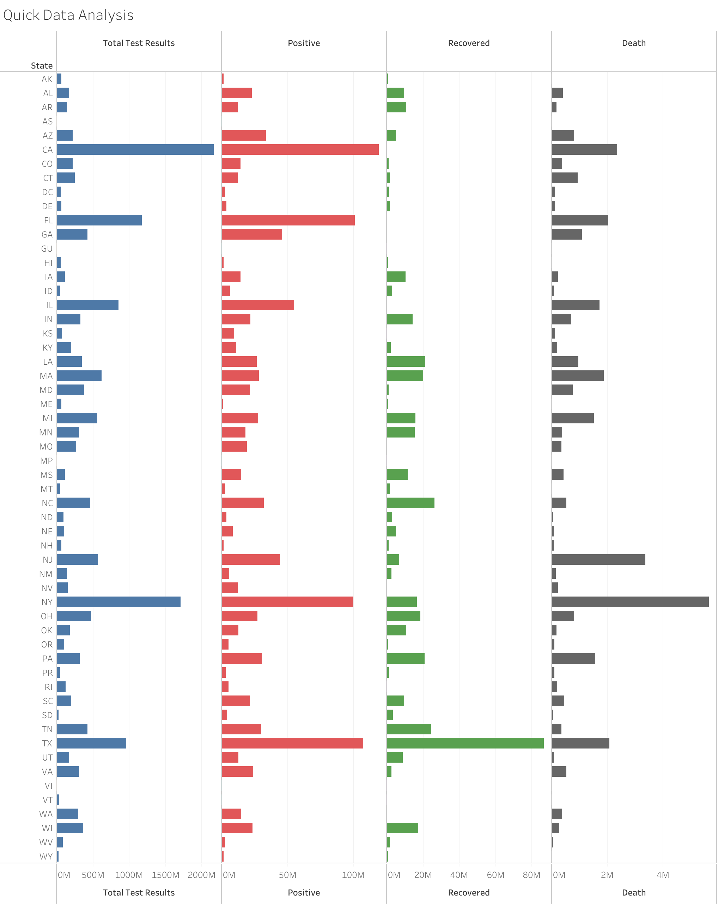
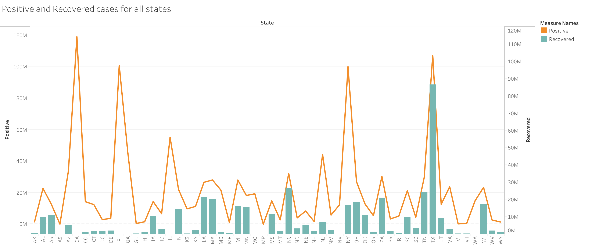
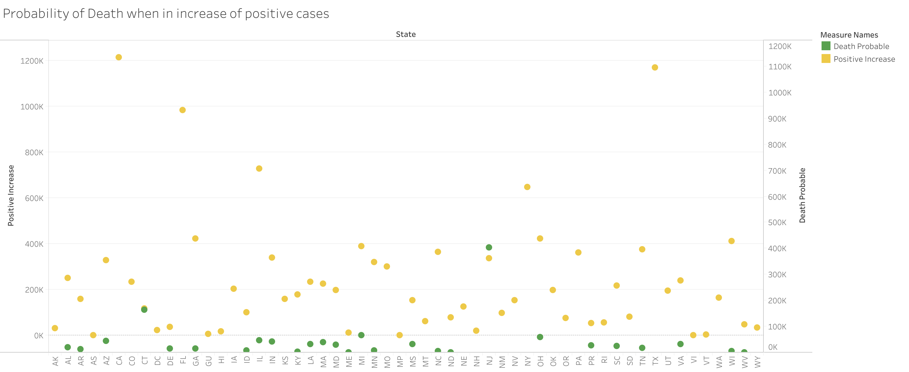
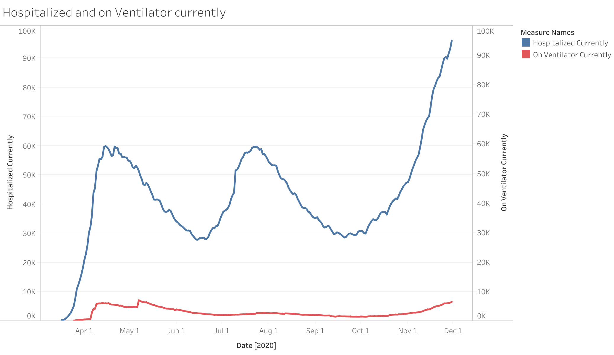

```{r setup, include=FALSE}
library(dplyr)
library(tidyverse)
library(ggplot2)
```


### Description of Dataset:

I have chosen COVID Tracking Project. This data set provides the daily live tracking information for all the 56 USA states and territories in three main areas such as total tests, patient outcomes, and demographic information with data quality grade. This data set has around 14786 observations with 42 columns and it is a mix between categorical and numeric values.
Here is the link to my dataset: https://covidtracking.com/about-data

### Description of EDA process:

Exploratory Data Analysis is an approach of analyzing the datasets to summarize and find the relationship between each variable in the data set. 
The very first initial question that comes to any person when we talked about COVID is how many current positive cases are there ?.  
To figure this out we can find by checking the number of positive cases concerning the total number of tests given. I wanted to show a quick analysis of total how many tests are given and in which how many are the number of positive cases, recovered cases and the number of people died till now. 

 I have used tableau online to show the quick analysis of COVID data. I have used small multiples here because it is like a group of charts which allows the user to compare trends in a single view. By using a dual-axis, I have created small multiples and I have used different colors for the data labels to identify them easily. 



From the above figure, we can say that California and Texas states are having a high number of positive cases concerning the total tests were given and also with the population of those states. Whereas Newyork has the highest number of deaths.
 
### Detailed Questions:

I have gone through the below-mentioned references and checked the various dashboards then I have figured out a few questions which I wanted to explore on my own. I used tableau online here is the link:
https://prod-useast-a.online.tableau.com/t/oducs625/authoring/HW7-1/Sheet1#1

Below are the questions :

##### i) Using the above analysis I wanted to find how many people are having positive cases and how many people are getting recovered from those. 

Proposed solution: As the number of cases count is increasing daily, I wanted to know about the people getting recovered from the covid positive. To figure this out, I have used a combo chart i.e a bar chart with a line, this combination chart gives a clear view of which category is higher or lower.



I am not sure whether this is correct or not, but as per my understanding, the bar shows the values of total positive cases in that particular state. The line chart describes the total of recovered people in that area. In some areas like CA, the positive case count is more and the recovered case count is very less i.e less than a million recovered cases.

##### ii) From the data, I wanted to show the probability of death when an increase in positive cases.

Proposed solution:  I wanted to figured out the relation between the positive cases count and the total deaths. How the affect of positive cases leading to the death trend. I preferred a Scatter plot to find this relation because in a Scatter plot we can show how much one variable is affected by another. 



By seeing the above image we can say that the probability of death is compartively less when people have positive cases. It shows that most people are getting recovered from the virus. Connecticut is the only state where the death probability rate is almost equal to the number of positive cases count when compared to all other states in USA.

##### iii) Finding out the currently hospitalized patients and among those who are on the ventilator.

Proposed solution: I have used line charts here because line charts are used to compare changes over the same period for more than one group.




From the above chart, we could say that the people hospitalized are more and there are less number of critical people. If we observe the graph, the count is slightly started increasing at the end of november month.

### References:

1. WHO covid dashboard : https://covid19.who.int/?gclid=CjwKCAiA8Jf-BRB-EiwAWDtEGlICSK2VE__vQcfvD1fSqwPb9yHdvZe33CARPiW39eVg5ldKrUt-WRoCaGEQAvD_BwE
2. Worldometer : https://www.worldometers.info/coronavirus/country/us/
3. Coronavirus resource center: https://coronavirus.jhu.edu/us-map