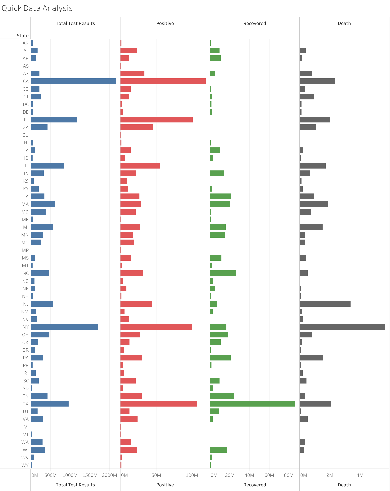
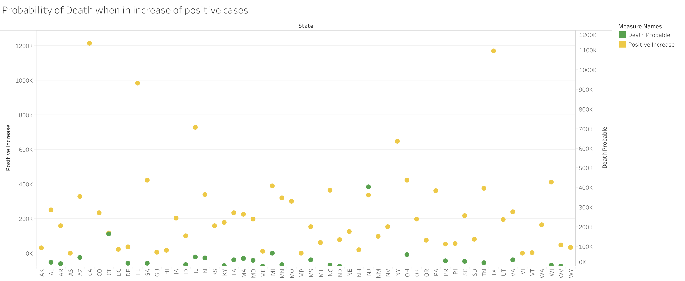

CS625-HW7
================
Anuradha Mantena
11/29/2020

### Description of Dataset:

I have chosen COVID Tracking Project. This data set provides the daily
live tracking information for all the 56 USA states and territories in
three main areas such as total tests, patient outcomes, and demographic
information with data quality grade. This data set has around 14786
observations with 42 columns and it is a mix between categorical and
numeric values. Here is the link to my dataset:
<https://covidtracking.com/about-data>

### Description of EDA process:

Exploratory Data Analysis is an approach of analyzing the datasets to
summarize and find the relationship between each variable in the data
set. The very first initial question that comes to any person when we
talked about COVID is how many current positive cases are there ?.  
To figure this out we can find by checking the number of positive cases
concerning the total number of tests given. I wanted to show a quick
analysis of total how many tests are given and in which how many are the
number of positive cases, recovered cases and the number of people died
till now.

I have used tableau online to show the quick analysis of COVID data. I
have used small multiples here because it is like a group of charts
which allows the user to compare trends in a single view. By using a
dual-axis, I have created small multiples and I have used different
colors for the data labels to identify them easily.

From the above figure, we can say that California and Texas states are
having a high number of positive cases concerning the total tests were
given and also with the population of those states. Whereas Newyork has
the highest number of deaths.

### Detailed Questions:

I have gone through the below-mentioned references and checked the
various dashboards then I have figured out a few questions which I
wanted to explore on my own. I used tableau online here is the link:
<https://prod-useast-a.online.tableau.com/t/oducs625/authoring/HW7-1/Sheet1#1>

Below are the questions :

##### i) Using the above analysis I wanted to find how many people are having positive cases and how many people are getting recovered from those.

Proposed solution: As the number of cases count is increasing daily, I
wanted to know about the people getting recovered from the covid
positive. To figure this out, I have used a combo chart i.e a bar chart
with a line, this combination chart gives a clear view of which category
is higher or lower. 

I am not sure whether this is correct or not, but as per my
understanding, the bar shows the values of total positive cases in that
particular state. The line chart describes the total of recovered people
in that area. In some areas like CA, the positive case count is more and
the recovered case count is very less i.e less than a million recovered
cases.

##### ii) From the data, I wanted to show the probability of death when an increase in positive cases.

Proposed solution: I wanted to figured out the relation between the
positive cases count and the total deaths. How the affect of positive
cases leading to the death trend. I preferred a Scatter plot to find
this relation because in a Scatter plot we can show how much one
variable is affected by another.

By seeing the above image we can say that the probability of death is
compartively less when people have positive cases. It shows that most
people are getting recovered from the virus. Connecticut is the only
state where the death probability rate is almost equal to the number of
positive cases count when compared to all other states in USA.

##### iii) Finding out the currently hospitalized patients and among those who are on the ventilator.

Proposed solution: I have used line charts here because line charts are
used to compare changes over the same period for more than one group.

From the above chart, we could say that the people hospitalized are more
and there are less number of critical people. If we observe the graph,
the count is slightly started increasing at the end of november month.

### References:

1.  WHO covid dashboard :
    <https://covid19.who.int/?gclid=CjwKCAiA8Jf-BRB-EiwAWDtEGlICSK2VE__vQcfvD1fSqwPb9yHdvZe33CARPiW39eVg5ldKrUt-WRoCaGEQAvD_BwE>
2.  Worldometer :
    <https://www.worldometers.info/coronavirus/country/us/>
3.  Coronavirus resource center: <https://coronavirus.jhu.edu/us-map>
