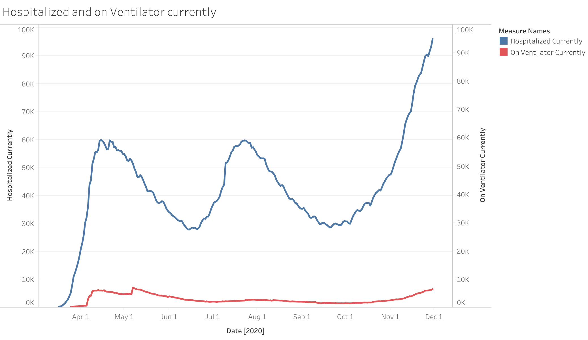
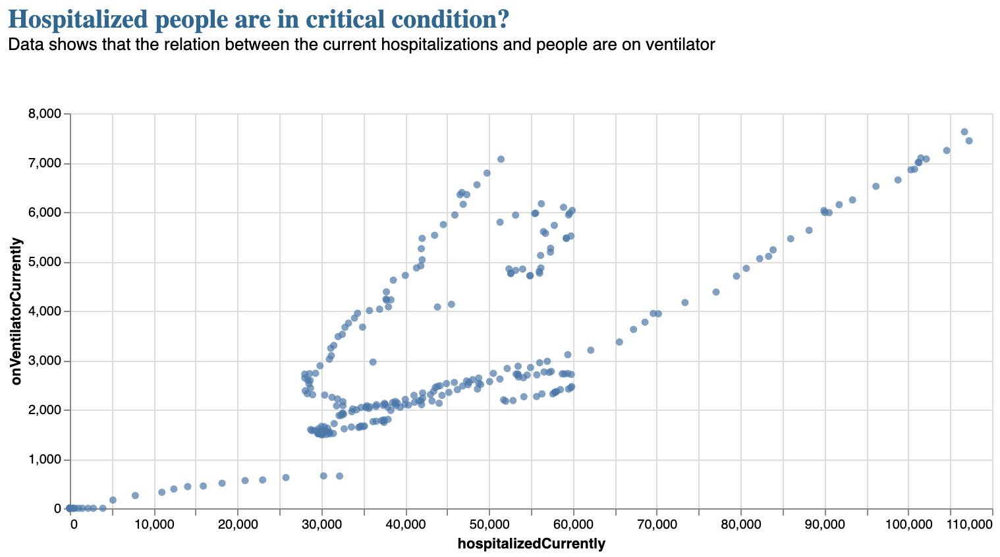
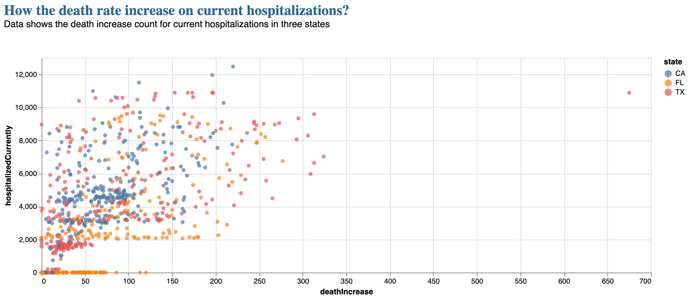

### Description of Dataset:

I have chosen COVID Tracking Project. This project provides the daily live tracking information for all the 56 USA states and territories in three main areas such as total tests, patient outcomes, and demographic information with data quality grade. I have considered both the all-states-history.csv dataset and the national-history.csv dataset. 

All states history dataset: This data set provides the daily information for each state in the US with around 14786 observations with 42 columns and it is a mix between categorical and numeric values.

National History dataset: This data set has all the combined 56 states of information with around 325 observations with 18 columns and it is a mix between categorical and numeric values.

Here is the main link to my dataset: https://covidtracking.com/about-data

### Chart from HW-7:

For HW-7, one of the final questions that I came up with after doing Exploratory Data Analysis on the dataset is: 

**Question:** Finding out the currently hospitalized patients and among those who are on the ventilator.

And, to answer this question I have used *tableau* : 

- Tableau Online link: https://prod-useast-a.online.tableau.com/#/site/oducs625/workbooks/267323?:origin=card_share_link

- Image of HW7 chart:

### Refining the draft chart:

To refine the above plot and make it interactive, I have used Vegalite. 

- Link to the observable notebook: https://observablehq.com/d/3ef0c3f2fdb16049

I have used the national-history dataset which has all the combined 56 states information on the daily count. The below chart shows all the US states current hospitalized and on ventilator information

- Image of the refined chart:
  

### Explanation of how your final chart answers the question you asked in HW7: 

For the HW7 draft, I used a line chart to show the comparison between the people hospitalized currently and the people on ventilators currently. I showed this using tableau online. There I considered the date, hospitalized currently, and Onventilator currently columns. I showed the graph with a dual-axis which has the same axis range for both attributes. But there should only be one axis when we are representing two quantitative attributes with respect to an ordered attribute. So I decided to show the refined output for this particular chart.

Here I have taken the national-history data both the CSV files have accurate data, the reason why I have considered this CSV file here in HW8 is to find the overall hospitalizations in the US. If I consider the all-states-history.csv file I have to do pivot for the whole data to get each state's current number. So I have considered the national-history.csv file to answer the question.

From the above figure, it is observed that more than 100k people are hospitalized and about 7500 people are currently on a ventilator in the US. This shows that the people being hospitalized are getting recovered and about 10% of people are in a critical stage. 

### How your headline fits your chart :

I have given the title **Hospitalized people are in Critical Condition?**

I chose the above title because when we look at a chart or graph, like the above, we don’t see everything at once but we instead focus on one salient point i.e title (from reference 1 i.e storytelling tips). I feel like it increases the viewer's curiosity to know whether the information is correct or not.

I have given the subtitle **Data shows that the relation between the current hospitalizations and people are on ventilator** tells us the instructions on how to explore the chart. (see reference 2 - explains the title and subtitle importance)

### Description of all design decisions made in transforming from the draft to the refined chart:

*scatter plots* are ideal for visualizing the relationship between two quantitative variables. Here I have used the scatter plot to figure out the relation between both the on a ventilator and are hospitalized entries.

The *marks* are basic geometric elements that depict items or links. Here for the scatter plots, points are the marks.

The *channels* control the appearance of a mark. Here channels are with positions both horizontal and vertical, color is blue, the shape is circle and size as default.

In the previous HW7 draft, I have used the lines as marks basically line charts are used to compare the values that change over time. Here I am taking the overall data with a period of time i.e overall 2020 for all the US states.

### Discuss the visualization principles from the semester that were incorporated into the final visualization:

To answer this point, I have taken reference from visualization guiding principles(see reference 3)

- One of the basic principles is to be clear on our intent. What are we going to show the audience? Here I wanted to show the relation for both currently hospitalized and are on the ventilator.
- Data cleaning is required for some datasets to show the exploratory data analysis.
- Choosing the correct graph, we should have a clear idea on idioms which idiom is suitable for what analysis. Here is my case, I have considered the scatter plot to show the relation.
- Make sure where the audience pays their attention, one is the title should attract and the other is the colors that we are using to depict the graph.
- Don’t over complicate the graphs with different designs and patterns.

### Refining another chart :

I have considered another chart for refining which is not done in my previous HW7. As the professor suggested, I tried on the hospitalizations vs. deaths changed over time. I performed this chart in vegalite. Here is the link to the observable notebook: https://observablehq.com/d/3ef0c3f2fdb16049

- Image of the refined chart:

### Explanation of how your final chart answers the question you asked in HW7: 

**Question:** Finding out the currently hospitalized patients and the death rate.

To figure this out, I have considered all-states-history data and filtered out for the states CA, TX, and FL. These three states have a high number of cases as per the world meter (see reference 4).  I wanted to find out the current hospitalizations over time with respect to the total deaths. But the column death in the CSV file gives the total death since Jan 2020. The currently hospitalized column gives the people hospitalized on that day information. If I compare and draw the graph for the current hospitalizations with the overall death rate it wouldn't be correct. 

Here I have taken the current hospitalizations with daily death increase rate. It gives information about the people who are currently hospitalized with the death increase rate. I have considered the hospitalized currently on the y axis and death increase on the x-axis for three states. From the graph, we can say that the current hospitalizations are more and the death Increase rate is less. 

### How your headline fits your chart :

I have given the title **How the death rate increase on current hospitalizations??**

I somehow felt the title increases the viewer's curiosity to know whether there is an increase in the death rate with the current hospitalizations.

I have given the subtitle **Data shows the death increase count for current hospitalizations in three states** gives the information about the count in the chart. 

### Description of all design decisions made in transforming from the draft to the refined chart:

*scatter plots* are ideal for visualizing the relationship between two quantitative variables. Here I have used the scatter plot to figure out how the currently hospitalized and death rate varies.

The *marks* are basic geometric elements that depict items or links. Here for the scatter plots, points are the marks.

The *channels* control the appearance of a mark. 

- Vertical position - hospitalizedCurrently,
- Horizontal position - deathIncrease,
- color represents the three states i.e CA, TX, and FL. 
- shape is circle and size as default.

### References: 

1. Storytelling tips: https://visme.co/blog/data-storytelling-tips/

2. Mastering Data Storytelling: https://www.crazyegg.com/blog/data-storytelling-5-steps-charts/

3. Visualization guiding principles: http://www.storytellingwithdata.com/blog/2017/8/9/my-guiding-principles

4. Worldometer:https://www.worldometers.info/coronavirus/country/us/

5. Vega-lite Documentation: https://vega.github.io/vega/docs/

