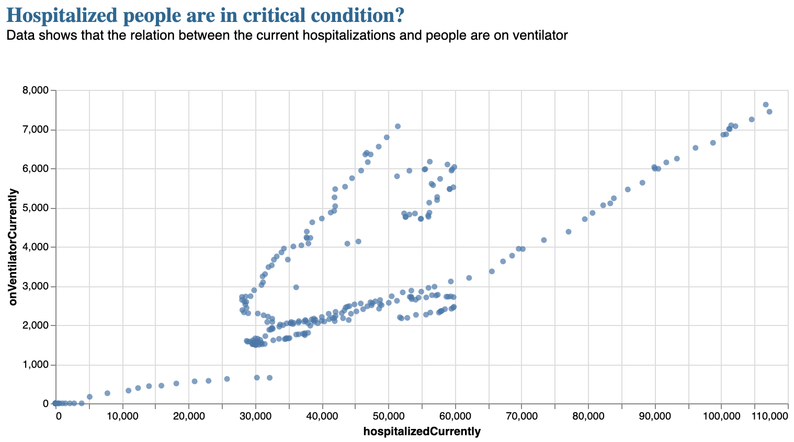
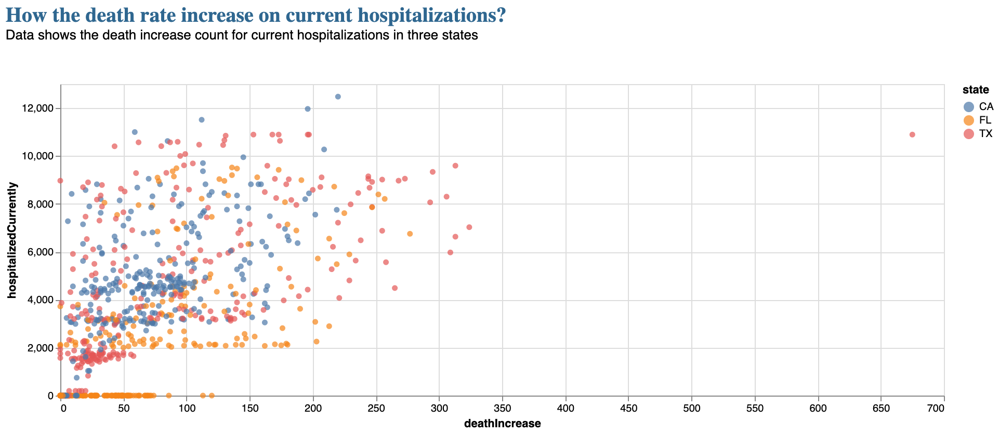

CS625-HW8
================
Anuradha Mantena
12/10/2020

### Description of Dataset:

I have chosen COVID Tracking Project. This project provides the daily
live tracking information for all the 56 USA states and territories in
three main areas such as total tests, patient outcomes, and demographic
information with data quality grade. I have considered both the
all-states-history.csv dataset and the national-history.csv dataset.

All states history dataset: This data set provides the daily information
for each state in the US with around 14786 observations with 42 columns
and it is a mix between categorical and numeric values.

National History dataset: This data set has all the combined 56 states
of information with around 325 observations with 18 columns and it is a
mix between categorical and numeric values.

Here is the main link to my dataset:
<https://covidtracking.com/about-data>

### Chart from HW-7:

For HW-7, one of the final questions that I came up with after doing
Exploratory Data Analysis on the dataset is:

**Question:** Finding out the currently hospitalized patients and among
those who are on the ventilator.

And, to answer this question I have used *tableau* :

  - Tableau Online link:
    <https://prod-useast-a.online.tableau.com/#/site/oducs625/workbooks/267323>?:origin=card\_share\_link

  - Image of HW7 chart:

### Refining the draft chart:

To refine the above plot and make it interactive, I have used Vegalite.

  - Link to the observable notebook:
    <https://observablehq.com/d/3ef0c3f2fdb16049>

I have used the national-history dataset which has all the combined 56
states information on the daily count. The below chart shows all the US
states current hospitalized and on ventilator information

  - Image of the refined chart:   

### Explanation of how your final chart answers the question you asked in HW7:

For the HW7 draft, I used a line chart to show the comparison between
the people hospitalized currently and the people on ventilators
currently. I showed this using tableau online. There I considered the
date, hospitalized currently, and Onventilator currently columns. I
showed the graph with a dual-axis which has the same axis range for both
attributes. But there should only be one axis when we are representing
two quantitative attributes with respect to an ordered attribute. So I
decided to show the refined output for this particular chart.

Here I have taken the national-history data both the CSV files have
accurate data, the reason why I have considered this CSV file here in
HW8 is to find the overall hospitalizations in the US. If I consider the
all-states-history.csv file I have to do pivot for the whole data to get
each state’s current number. So I have considered the
national-history.csv file to answer the question.

From the above figure, it is observed that more than 100k people are
hospitalized and about 7500 people are currently on a ventilator in the
US. This shows that the people being hospitalized are getting recovered
and about 10% of people are in a critical stage.

### How your headline fits your chart :

I have given the title **Hospitalized people are in Critical
Condition?**

I chose the above title because when we look at a chart or graph, like
the above, we don’t see everything at once but we instead focus on one
salient point i.e title (from reference 1 i.e storytelling tips). I feel
like it increases the viewer’s curiosity to know whether the information
is correct or not.

I have given the subtitle **Data shows that the relation between the
current hospitalizations and people are on ventilator** tells us the
instructions on how to explore the chart. (see reference 2 - explains
the title and subtitle importance)

### Description of all design decisions made in transforming from the draft to the refined chart:

*scatter plots* are ideal for visualizing the relationship between two
quantitative variables. Here I have used the scatter plot to figure out
the relation between both the on a ventilator and are hospitalized
entries.

The *marks* are basic geometric elements that depict items or links.
Here for the scatter plots, points are the marks.

The *channels* control the appearance of a mark. Here channels are with
positions both horizontal and vertical, color is blue, the shape is
circle and size as default.

In the previous HW7 draft, I have used the lines as marks basically line
charts are used to compare the values that change over time. Here I am
taking the overall data with a period of time i.e overall 2020 for all
the US states.

### Discuss the visualization principles from the semester that were incorporated into the final visualization:

To answer this point, I have taken reference from visualization guiding
principles(see reference 3)

  - One of the basic principles is to be clear on our intent. What are
    we going to show the audience? Here I wanted to show the relation
    for both currently hospitalized and are on the ventilator.
  - Data cleaning is required for some datasets to show the exploratory
    data analysis.
  - Choosing the correct graph, we should have a clear idea on idioms
    which idiom is suitable for what analysis. Here is my case, I have
    considered the scatter plot to show the relation.
  - Make sure where the audience pays their attention, one is the title
    should attract and the other is the colors that we are using to
    depict the graph.
  - Don’t over complicate the graphs with different designs and
    patterns.

### Refining another chart :

I have considered another chart for refining which is not done in my
previous HW7. As the professor suggested, I tried on the
hospitalizations vs. deaths changed over time. I performed this chart in
vegalite. Here is the link to the observable notebook:
<https://observablehq.com/d/3ef0c3f2fdb16049>

  - Image of the refined chart:
    

### Explanation of how your final chart answers the question you asked in HW7:

**Question:** Finding out the currently hospitalized patients and the
death rate.

To figure this out, I have considered all-states-history data and
filtered out for the states CA, TX, and FL. These three states have a
high number of cases as per the world meter (see reference 4). I wanted
to find out the current hospitalizations over time with respect to the
total deaths. But the column death in the CSV file gives the total death
since Jan 2020. The currently hospitalized column gives the people
hospitalized on that day information. If I compare and draw the graph
for the current hospitalizations with the overall death rate it wouldn’t
be correct.

Here I have taken the current hospitalizations with daily death increase
rate. It gives information about the people who are currently
hospitalized with the death increase rate. I have considered the
hospitalized currently on the y axis and death increase on the x-axis
for three states. From the graph, we can say that the current
hospitalizations are more and the death Increase rate is less.

### How your headline fits your chart :

I have given the title **How the death rate increase on current
hospitalizations??**

I somehow felt the title increases the viewer’s curiosity to know
whether there is an increase in the death rate with the current
hospitalizations.

I have given the subtitle **Data shows the death increase count for
current hospitalizations in three states** gives the information about
the count in the chart.

### Description of all design decisions made in transforming from the draft to the refined chart:

*scatter plots* are ideal for visualizing the relationship between two
quantitative variables. Here I have used the scatter plot to figure out
how the currently hospitalized and death rate varies.

The *marks* are basic geometric elements that depict items or links.
Here for the scatter plots, points are the marks.

The *channels* control the appearance of a mark.

  - Vertical position - hospitalizedCurrently,
  - Horizontal position - deathIncrease,
  - color represents the three states i.e CA, TX, and FL.
  - shape is circle and size as default.

### References:

1.  Storytelling tips: <https://visme.co/blog/data-storytelling-tips/>

2.  Mastering Data Storytelling:
    <https://www.crazyegg.com/blog/data-storytelling-5-steps-charts/>

3.  Visualization guiding principles:
    <http://www.storytellingwithdata.com/blog/2017/8/9/my-guiding-principles>

4.  Worldometer:<https://www.worldometers.info/coronavirus/country/us/>

5.  Vega-lite Documentation: <https://vega.github.io/vega/docs/>
